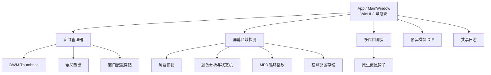

# Wineclouds Studio

> 面向 Windows 多窗口工作流的桌面工具：实时窗口预览、分组热键切换、屏幕区域颜色检测与多窗口同步。

Wineclouds Studio 是一个 WinUI 3 桌面应用，帮助用户在多开客户端、远程会话、构建任务或多显示器工作台中持续关注关键窗口和视觉状态。应用以管理员权限运行，以便稳定访问目标窗口、注册全局热键并执行窗口同步操作。

## 能力概览

| 模块 | 能力 |
| --- | --- |
| 窗口管理器 | 基于 DWM Thumbnail 的实时窗口缩略图、置顶显示、布局保存、点击激活与分组循环切换。 |
| 屏幕区域检测 | 框选虚拟桌面区域，按 HSV 容差、目标像素数、连通面积和确认帧数识别指定颜色；触发后循环播放本地 MP3。 |
| 多窗口同步 | 选择主控窗口和受控窗口，将鼠标与键盘输入同步到目标窗口组。 |
| 预留模块 | 模块 D–F 保留独立页面和导航入口，便于按模块继续扩展。 |

## 适用场景

- 多开应用：将关键客户端以实时缩略图固定在桌面上，通过点击或热键快速切换。
- 状态监看：监测远程桌面、构建任务、下载进度或告警区域的颜色变化。
- 多显示器协作：在整个虚拟桌面范围内选择检测区域，持续关注副屏状态。
- 重复性窗口操作：将一个窗口的鼠标、键盘输入同步到多个受控窗口。

## 架构



核心代码均位于 `src/WinecloudsStudio`：页面负责交互与生命周期，服务层封装 Windows API 和业务能力，`Core` 保持屏幕颜色分析与状态机的独立性，`Shared/Logging` 提供全局日志能力。

## 快速使用

### 窗口管理器

1. 在“窗口管理器”中刷新并选择要关注的窗口。
2. 设置缩略图尺寸、透明度、置顶、位置锁定与网格吸附。
3. 创建窗口分组并配置前进、后退热键。
4. 开始监控；可点击缩略图激活窗口，或用分组热键循环切换。

### 屏幕区域检测

1. 打开“屏幕区域检测”，框选需要监控的区域。
2. 选择或拾取目标颜色，并设置容差、最少目标像素、最小连通面积与确认帧数。
3. 选择本地 MP3 文件作为提醒声音。
4. 开始检测；目标颜色稳定出现时循环提醒，稳定消失后自动停止并重新布防。

### 多窗口同步

1. 打开“多窗口同步”，刷新窗口列表。
2. 选择一个主控窗口和至少一个受控窗口。
3. 启动同步后，在主控窗口中的鼠标、键盘操作会转发至受控窗口。
4. 停止同步或退出应用即可释放钩子与关联资源。

## 运行要求

- Windows 10 1809（17763）或更高版本，64 位系统。
- 应用启动时会请求管理员权限；若取消 UAC 提示，应用将退出。
- 使用窗口管理与同步功能时，目标应用也应以可访问的同等或更低权限运行。
- 声音提醒仅支持本地 MP3 文件。

## 从源码构建

开发环境：

- .NET 10 SDK
- Windows App SDK（通过 NuGet 还原）
- NSIS 3.x（仅创建安装包时需要）

```powershell
dotnet restore .\WinecloudsStudio.slnx
dotnet build .\WinecloudsStudio.slnx --configuration Release --property:Platform=x64
dotnet run --project .\src\WinecloudsStudio\WinecloudsStudio.csproj
```

创建自包含的 x64 安装包：

```powershell
.\scripts\New-Installer.ps1 -Configuration Release
```

安装包输出到 `artifacts\installer\output\`，发布载荷输出到 `artifacts\installer\publish-win-x64\`。两者都是可再生产物，不应提交到版本库。

## 项目结构

```text
WinecloudsStudio.slnx
├── src/WinecloudsStudio/
│   ├── App.xaml(.cs)                 # 应用启动、提权与关闭生命周期
│   ├── MainWindow.xaml(.cs)          # 导航壳与模块页面缓存
│   ├── Assets/                       # 应用图标和资源
│   ├── Modules/
│   │   ├── Home/                     # 首页
│   │   ├── WindowManager/            # 缩略图、热键、窗口配置与 Windows API 互操作
│   │   ├── ScreenDetection/          # 捕获、颜色识别、状态机、提醒与配置
│   │   ├── Reserved/                 # 多窗口同步及预留模块 D-F
│   │   └── Navigation/               # 未实现模块的兜底页面
│   └── Shared/Logging/               # 异步文件日志
├── installer/                        # NSIS 安装器定义
├── scripts/New-Installer.ps1         # 发布与打包脚本
└── README.md
```

## 配置、日志与故障排查

应用数据位于 `%LOCALAPPDATA%\WinecloudsStudio\`：

| 文件 | 用途 |
| --- | --- |
| `window_manager_config.json` | 窗口管理器的缩略图、分组与显示配置。 |
| `screen-region-detector.json` | 屏幕区域检测参数与声音文件路径。 |
| `logs\wineclouds_yyyyMMdd.log` | 按天滚动的运行日志。 |

日志对未处理异常和未观察任务异常进行记录；错误级别消息会立即落盘，普通消息由后台线程批量刷新。日志默认保留最近 7 天，适合在启动失败、热键注册失败、窗口操作失败或检测异常时提供排查依据。

常见问题：

- **无法激活或同步目标窗口**：确认 Wineclouds Studio 已以管理员权限运行，并检查目标窗口未被更高权限进程保护。
- **热键无法注册**：该组合键可能已被其他程序占用；更换为未占用的键位后重试。
- **颜色检测误报**：提高最少目标像素数或最小连通面积，适当收紧颜色容差，并增加确认帧数。
- **没有声音提醒**：确认选择的是可读取的本地 MP3 文件，且 Windows 当前音频输出可用。

## 发布约定

- 仅提交源码、构建脚本、安装器定义和必要的资源文件。
- `bin/`、`obj/`、`.vs/`、`artifacts/` 等构建缓存和发布产物必须忽略。
- 配置、日志、密钥和其他敏感本地文件不得提交；若确有必要，应提供脱敏的 `.example` 示例文件。
- 安装包使用 LZMA 固实压缩，并以自包含方式发布，避免依赖用户机器上的共享运行时。

## 许可证

[MIT License](LICENSE)
